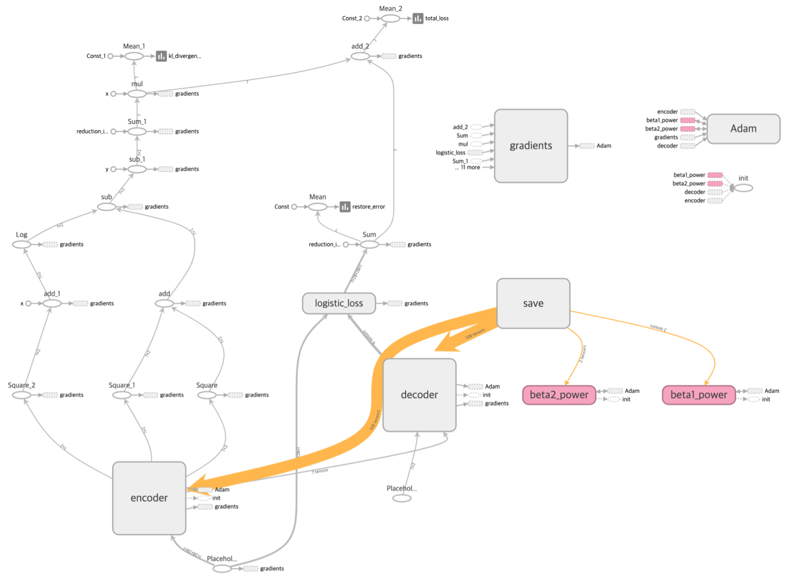

Convolutional Variational Auto-Encoder (CVAE)
=====

Implementation of CVAE

## Graph in TensorBoard

    
  
Reconstructed image in each iteration.

## Environment
* Python 3.7.4  
* Tensorflow 1.14.0  
* Numpy 1.17.1
* Matplotlib 3.1.1
* Scikit Learn (sklearn) 0.21.3

## Reference
[1] Kingma, D. P., & Welling, M. (2013). <a href="https://arxiv.org/abs/1312.6114">Auto-encoding variational bayes</a>. arXiv preprint arXiv:1312.6114.
[2] <a href="https://en.wikipedia.org/wiki/Kullback%E2%80%93Leibler_divergence">Kullback Leibler divergence</a>. Wikipedia
