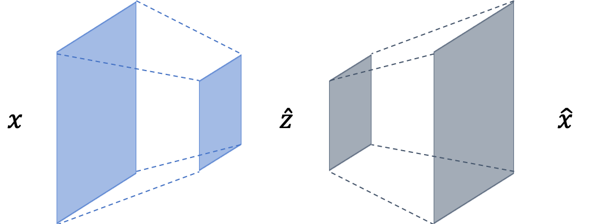
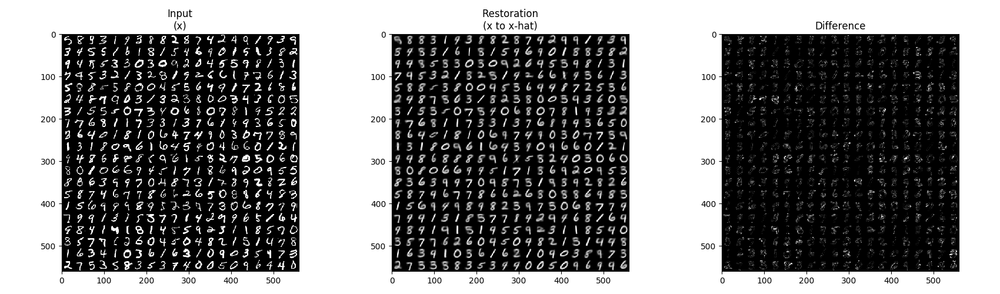
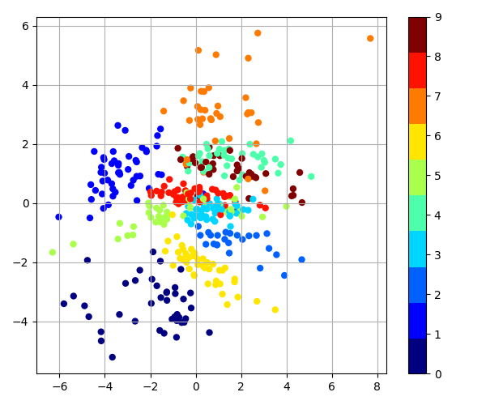
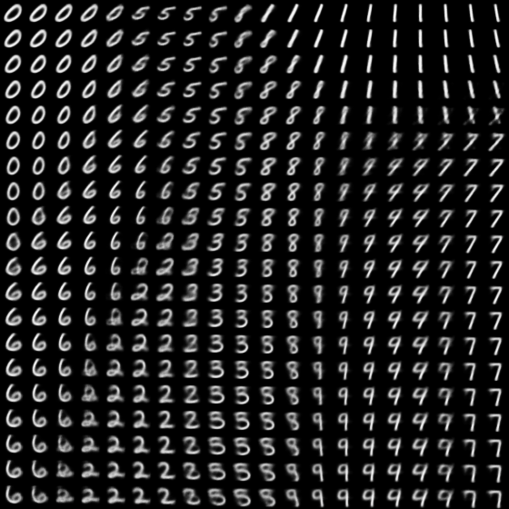

Convolutional Variational Auto-Encoder (CVAE)
=====

Implementation of CVAE

## Architecture

    
  
Simplified VAE architecture.

## Graph in TensorBoard

    
  
Graph of CVAE.

## Results

    
  
Restoration result by CVAE.

    
  
Latent vector space, and reconstruction result of latent space walking.

## Environment
* Python 3.7.4  
* Tensorflow 1.14.0  
* Numpy 1.17.1  
* Matplotlib 3.1.1  
* Scikit Learn (sklearn) 0.21.3  

## Reference
[1] Kingma, D. P., & Welling, M. (2013). <a href="https://arxiv.org/abs/1312.6114">Auto-encoding variational bayes</a>. arXiv preprint arXiv:1312.6114.  
[2] <a href="https://en.wikipedia.org/wiki/Kullback%E2%80%93Leibler_divergence">Kullback Leibler divergence</a>. Wikipedia
